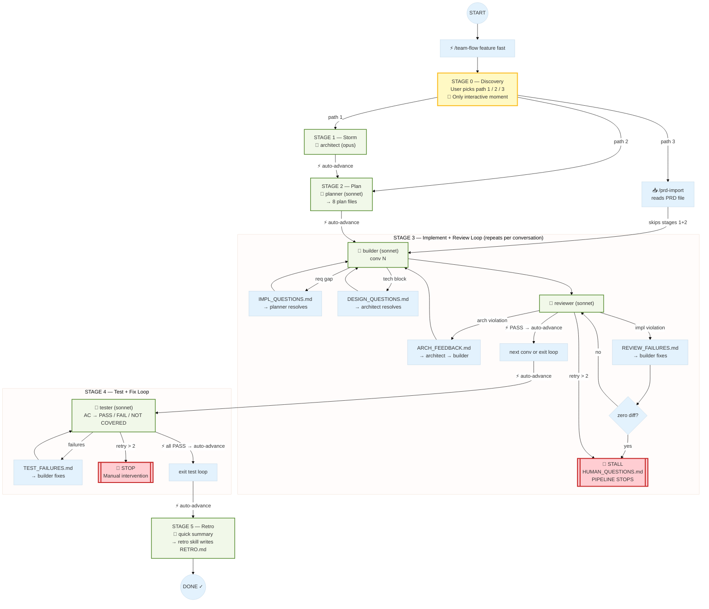

# Fast Mode Flow — `/team-flow <feature> fast`

All human pause points between stages are skipped. `HumanResponseEvent("auto-advance")` is logged at each skipped gate. Hard stops (stalls, retry limits, `HUMAN_QUESTIONS.md`) still block the pipeline.

---

## ASCII Flow

```
/team-flow <feature> fast
         │
         ▼
╔══════════════════════════════════════╗
║  STAGE 0 — Discovery Path           ║
║  [1] Quick storm                    ║
║  [2] Skip discovery                 ║
║  [3] Import PRD                     ║
╚══════════════════════════════════════╝
         │  (user picks path once — only interactive moment)
         ▼
╔══════════════════════════════════════╗
║  STAGE 1 — Storm (if path 1)        ║
║  architect (opus)                   ║
╚══════════════════════════════════════╝
         │
         │  ⚡ AUTO-ADVANCE (no pause)
         ▼
╔══════════════════════════════════════╗
║  STAGE 2 — Plan                     ║
║  planner (sonnet)                   ║
║  → 8 plan files in plans/<feature>/ ║
╚══════════════════════════════════════╝
         │
         │  ⚡ AUTO-ADVANCE (no pause)
         ▼
╔══════════════════════════════════════════════════════════╗
║  STAGE 3 — Implement + Review Loop (repeats per conv)   ║
║                                                          ║
║  ┌───────────────────────────────────────────────────┐  ║
║  │  builder (sonnet) — conv N                        │  ║
║  └───────────────┬───────────────────────────────────┘  ║
║                  │                                       ║
║         requirement gap? ──► IMPL_QUESTIONS.md           ║
║                  │              planner resolves         ║
║         tech blocker?   ──► DESIGN_QUESTIONS.md          ║
║                  │              architect resolves       ║
║                  ▼                                       ║
║  ┌───────────────────────────────────────────────────┐  ║
║  │  reviewer (sonnet)                                │  ║
║  └───────────────┬───────────────────────────────────┘  ║
║                  │                                       ║
║         arch violation? ──► ARCH_FEEDBACK.md             ║
║                  │              architect → builder      ║
║         impl violation? ──► REVIEW_FAILURES.md           ║
║                  │              builder → zero-diff chk  ║
║                  │                                       ║
║         zero diff? ─────► HUMAN_QUESTIONS.md [STALL] ◄──║──┐
║                  │         🛑 PIPELINE STOPS HERE        ║  │
║                  │                                       ║  │
║         retry > 2? ────── escalate → same STALL ─────── ║──┘
║                  │                                       ║
║                  │  PASS                                 ║
║                  ▼                                       ║
║         ⚡ AUTO-ADVANCE — next conv                      ║
╚══════════════════════════════════════════════════════════╝
         │
         │  ⚡ AUTO-ADVANCE (no pause)
         ▼
╔══════════════════════════════════════════════════════════╗
║  STAGE 4 — Test + Fix Loop                              ║
║                                                          ║
║  ┌───────────────────────────────────────────────────┐  ║
║  │  tester (sonnet)                                  │  ║
║  │  maps every AC → PASS / FAIL / NOT COVERED        │  ║
║  └───────────────┬───────────────────────────────────┘  ║
║                  │                                       ║
║         failures? ──► TEST_FAILURES.md → builder fixes   ║
║                  │    builder → tester re-checks         ║
║                  │    retry > 2? → 🛑 STOP               ║
║                  │                                       ║
║                  │  all PASS                             ║
║                  ▼                                       ║
║         ⚡ AUTO-ADVANCE (no pause)                       ║
╚══════════════════════════════════════════════════════════╝
         │
         ▼
╔══════════════════════════════════════╗
║  STAGE 5 — Retro                    ║
║  quick (haiku)                      ║
║  → RETRO.md + LESSONS_CANDIDATE.md  ║
╚══════════════════════════════════════╝
         │
         ▼
       DONE ✓


Legend:
  ⚡ AUTO-ADVANCE   = pause skipped, HumanResponseEvent("auto-advance") logged
  🛑 PIPELINE STOPS = hard stops that survive fast mode
```

---

## Mermaid Diagram


