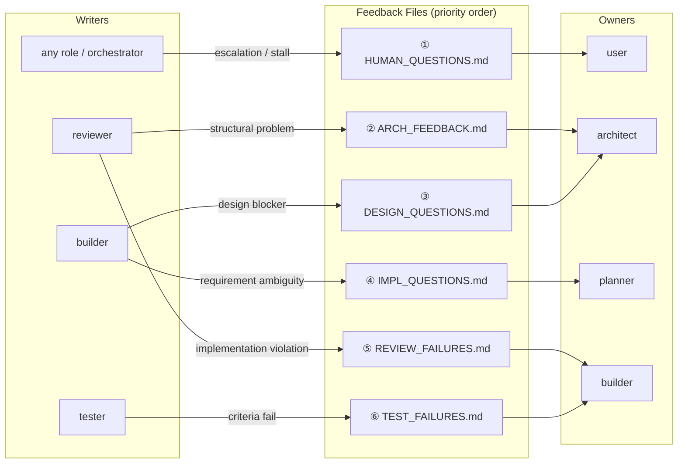

# Feedback File Protocol

Feedback files are Pathly's control-plane signals. They live under
`plans/<feature>/feedback/`.

File present means issue open. File deleted means resolved.

## Files

| File | Written by | Resolved by | Purpose |
|---|---|---|---|
| `ARCH_FEEDBACK.md` | reviewer or tester | architect | Structural or design problem blocks implementation. |
| `REVIEW_FAILURES.md` | reviewer | builder | Implementation problem that can be fixed without redesign. |
| `TEST_FAILURES.md` | tester | builder | Acceptance criteria fail or lack coverage. |
| `IMPL_QUESTIONS.md` | builder | planner | Requirement ambiguity: what should this do? |
| `DESIGN_QUESTIONS.md` | builder | architect | Technical blocker: how should this be built safely? |
| `HUMAN_QUESTIONS.md` | any role or orchestrator | user | Product/business decision, stall, or unresolved loop. |

## Frontmatter

Each agent should inject YAML frontmatter into feedback files when creating them:

```yaml
---
created_at: 2026-05-04T08:12:00Z
created_by_event: evt-abc123
ttl_hours: 168
---
```

`/pathly verify`, `/pathly help --doctor`, and the startup check use this metadata to detect:

- **Orphan files** — `created_by_event` is not present in `EVENTS.jsonl` (file survived from a previous run)
- **Expired files** — current time exceeds `created_at + ttl_hours`

Both are safe to delete automatically.

Default TTL is **168 hours (1 week)**. This avoids false positives when users pause a feature for several days. Override per-file by writing a shorter `ttl_hours` value (e.g. `24` for files that should not survive a day).

If hooks are not installed, feedback files still work; they simply do not carry TTL metadata and orphan detection is skipped.

## Routing



When multiple files exist, the FSM routes one at a time using the priority
documented in [ORCHESTRATOR_FSM.md](ORCHESTRATOR_FSM.md).

## Question Tags

Builder questions should be tagged:

- `[REQ]` for requirement ambiguity, routed to planner.
- `[ARCH]` for technical/design blockers, routed to architect.
- `[UNSURE]` when ownership is unclear; write both question files and let the
  correct owner discard what is not theirs.

A classify-feedback hook can classify and split `IMPL_QUESTIONS.md` when
`ANTHROPIC_API_KEY` is available. It exits silently when unavailable so hooks
stay optional.

## Auto-Fix Review Findings

The reviewer may mark trivial findings as `[AUTO_FIX]` in
`REVIEW_FAILURES.md`. The builder applies those patches first, then handles any
regular violations. If an auto-fix patch does not apply cleanly, treat it as a
normal review failure.

## Resolution Rules

1. The owner fixes or answers the issue.
2. The owner deletes the feedback file.
3. The orchestrator sees no open feedback and resumes the previous state.
4. Max retry cycles are enforced **per feedback file creation event**, not per conversation number. The retry key is `event-<created_by_event>:<filename>`. This means replanning a conversation (which changes the conversation number) does not silently reset the retry counter for an existing feedback file.
5. Zero-diff review loops escalate to `HUMAN_QUESTIONS.md [STALL]`.

Feedback files are blocking. Pathly should not advance a workflow while any
known feedback file remains open.
