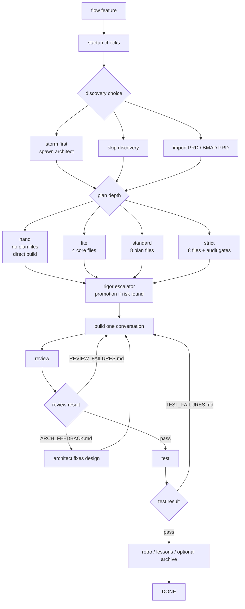

# Pathly Flow Diagram

Pathly has three public front doors over the same core workflows:

- Claude Code slash skills: `/pathly ...` and `/path ...`
- Codex plugin skills: `Use Pathly ...`
- CLI fallback: `pathly ...`

## High-Level Flow

```mermaid
flowchart TD
    A[plain-English request] --> B[/pathly dispatcher]
    B --> S[start\nwelcome + journey map]
    B --> PO[po\nProduct Owner Q&A → PO_NOTES.md]
    B --> ST[storm\narchitect brainstorm]
    B --> GO[go\ndirector routes intent]
    B --> BLD[build\nnext conversation]
    B --> C[help\nstate-aware numbered menu]
    B --> D[help --doctor\nstuck-state diagnostics]
    B --> E[explore\nread-only codebase investigation]
    B --> F[debug\nbug investigation workflow]
    B --> G[review\nreview current changes]
    B --> H[meet\ncontext-aware role consultation]
    B --> V[verify\nstale feedback / FSM drift]
    B --> I[flow / run\nfeature pipeline]

    S --> PO
    PO --> ST
    ST --> GO
    GO --> BLD
```

## Feature Pipeline



## Files Written By A Feature

```text
plans/<feature>/
|-- USER_STORIES.md
|-- IMPLEMENTATION_PLAN.md
|-- PROGRESS.md
|-- CONVERSATION_PROMPTS.md
|-- HAPPY_FLOW.md                 # standard/strict or escalator-added
|-- EDGE_CASES.md                 # standard/strict or escalator-added
|-- ARCHITECTURE_PROPOSAL.md      # standard/strict or escalator-added
|-- FLOW_DIAGRAM.md               # standard/strict or escalator-added
|-- STATE.json                    # runtime checkpoint when driver runs
|-- EVENTS.jsonl                  # append-only event log when driver runs
|-- consults/                     # meet notes
`-- feedback/
    |-- ARCH_FEEDBACK.md
    |-- REVIEW_FAILURES.md
    |-- IMPL_QUESTIONS.md
    |-- DESIGN_QUESTIONS.md
    |-- TEST_FAILURES.md
    `-- HUMAN_QUESTIONS.md
```

`lite` always creates the four core plan files. Extra planning files can be
added by explicit rigor or by the escalator when the workflow discovers risk.

## Feedback Routing

```text
reviewer -> ARCH_FEEDBACK.md    -> architect
reviewer -> REVIEW_FAILURES.md  -> builder
builder  -> IMPL_QUESTIONS.md   -> planner
builder  -> DESIGN_QUESTIONS.md -> architect
tester   -> TEST_FAILURES.md    -> builder
any role -> HUMAN_QUESTIONS.md  -> user
```

File exists means open. Deleting the file means resolved. The FSM must not move
forward while a known feedback file exists.

## Invocation Examples

Claude Code — FSM-style commands:

```text
/pathly start                           ← full journey map
/pathly po checkout-flow                ← clarify requirements first
/pathly storm                           ← brainstorm with architect
/pathly go add password reset           ← director routes new feature
/pathly build                           ← implement next conversation
/pathly meet checkout-flow              ← context-aware role consultation
/pathly debug checkout button does nothing
/pathly explore how does checkout state flow through the app?
/pathly verify                          ← check for stale feedback
/pathly end                             ← wrap up + retro
```

Codex:

```text
Use Pathly help
Use Pathly flow for checkout-flow
Use Pathly po for checkout-flow
Use Pathly to debug checkout button does nothing
Use Pathly to explore how checkout state flows
```

CLI:

```text
pathly help
pathly init checkout-flow
pathly flow checkout-flow --entry build
```
