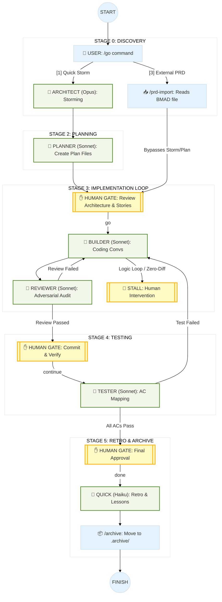
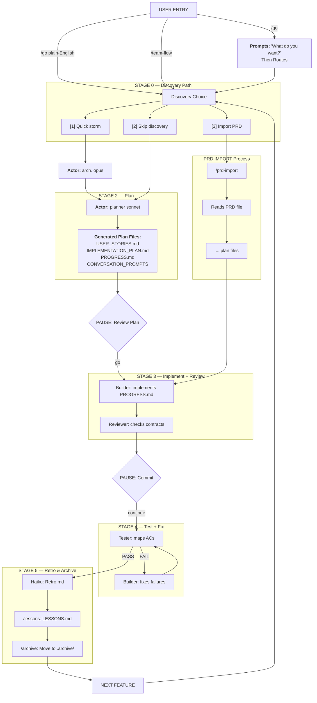

# Framework Flow Diagram

---

## Visual Overview (Mermaid)



---

## Detailed Pipeline (Mermaid)



---

## Full Lifecycle

```
  USER
   │
  │  /go                   ← prompts "What do you want?" then routes
  │  /go <plain English>   ← skip the prompt, routes immediately
  │  /team-flow <feature>  ← direct pipeline entry (power users)
  │  /team-flow <feature> lite|standard|strict
   ▼
╔══════════════════════════════════════╗
║  STAGE 0 — Discovery Path           ║
║                                     ║
║  [1] Quick storm                    ║
║  [2] Skip discovery                 ║
║  [3] Import PRD                     ║
╚══════════════════════════════════════╝
   │         │              │
  [1]       [2]            [3]
   │         │              │
   ▼         │              ▼
╔════════╗   │    ╔══════════════════╗
║ STORM  ║   │    ║  /prd-import     ║
║ arch.  ║   │    ║  reads PRD file  ║
║ (opus) ║   │    ║  → plan files    ║
╚════════╝   │    ╚══════════════════╝
   │         │              │
   │         │    (skips stages 1+2)
   ▼         ▼              │
╔══════════════════════════╗│
║  STAGE 2 — Plan          ║│
║  planner (sonnet)        ║│
║  → plans/<feature>/      ║│
║    USER_STORIES.md       ║│
║    IMPLEMENTATION_PLAN.md║│
║    PROGRESS.md           ║│
║    CONVERSATION_PROMPTS  ║│
║    HAPPY_FLOW.md         ║│
║    EDGE_CASES.md         ║│
║    ARCHITECTURE_PROPOSAL ║│
║    FLOW_DIAGRAM.md       ║│
╚══════════════════════════╝│
   │         ◄──────────────┘
   │  PAUSE: "Review plan. go / stop"
   ▼
╔══════════════════════════════════════════════════════╗
║  STAGE 3 — Implement + Review Loop                   ║
║                                                      ║
║  for each TODO conversation in PROGRESS.md:          ║
║                                                      ║
║  ┌─────────────────────────────────────────────┐    ║
║  │ builder (sonnet)                             │    ║
║  │                                             │    ║
║  │  BEFORE editing — gather context:           │    ║
║  │   ├─ quick (haiku)  ← atomic lookup         │    ║
║  │   │    ≤2 tool calls, no writes, ephemeral  │    ║
║  │   └─ scout (haiku) ×1-3                     │    ║
║  │        cross-file pattern lookup (5-15 calls)│    ║
║  │   cap: 4 sub-agents total; all read-only    │    ║
║  │   collect findings → form approach          │    ║
║  │                                             │    ║
║  │  THEN edit files as builder                 │    ║
║  │   implements conversation N                 │    ║
║  │   updates PROGRESS.md                       │    ║
║  │                                             │    ║
║  │   hits requirement gap? [REQ]               │    ║
║  │   → IMPL_QUESTIONS.md → planner clarifies   │    ║
║  │                                             │    ║
║  │   hits technical blocker? [ARCH]            │    ║
║  │   → DESIGN_QUESTIONS.md → architect fixes   │    ║
║  │                                             │    ║
║  │   unclear which? [UNSURE] → both files      │    ║
║  └──────────────────┬──────────────────────────┘    ║
║                     │                               ║
║                     ▼                               ║
║  ┌─────────────────────────────────────────────┐    ║
║  │ reviewer (sonnet)                            │    ║
║  │   checks .claude/rules/ contracts            │    ║
║  │                                             │    ║
║  │   architectural violation?                  │    ║
║  │   → ARCH_FEEDBACK.md → architect (BLOCKING) │    ║
║  │     architect redesigns → builder rebuilds  │    ║
║  │                                             │    ║
║  │   implementation violation?                 │    ║
║  │   → REVIEW_FAILURES.md → builder fixes      │    ║
║  │     zero git diff after fix?                │    ║
║  │     → HUMAN_QUESTIONS.md [STALL] → user     │    ║
║  │     diff present → reviewer re-checks       │    ║
║  │                                             │    ║
║  │   PASS → advance to next conversation       │    ║
║  └─────────────────────────────────────────────┘    ║
║                                                      ║
║  max 2 retry cycles per conversation + feedback file ║
║  exceeded → STOP, surface to user                    ║
║  zero-diff detected → STALL → HUMAN_QUESTIONS.md     ║
╚══════════════════════════════════════════════════════╝
   │
   │  PAUSE: "Commit. continue / stop"
   ▼
╔══════════════════════════════════════════════════════╗
║  STAGE 4 — Test + Fix Loop                           ║
║                                                      ║
║  ┌─────────────────────────────────────────────┐    ║
║  │ tester (sonnet)                              │    ║
║  │   reads USER_STORIES.md                     │    ║
║  │   maps each AC: PASS / FAIL / NOT COVERED   │    ║
║  │                                             │    ║
║  │   any failures?                             │    ║
║  │   → TEST_FAILURES.md → builder fixes        │    ║
║  │     builder fixes → tester re-checks        │    ║
║  │                                             │    ║
║  │   all PASS → proceed                        │    ║
║  └─────────────────────────────────────────────┘    ║
║                                                      ║
║  max 2 retry cycles → STOP, surface to user          ║
╚══════════════════════════════════════════════════════╝
   │
   │  PAUSE: "All ACs pass. done?"
   ▼
╔══════════════════════════════════════╗
║  STAGE 5 — Retro                    ║
║  quick (haiku)                      ║
║  → plans/<feature>/RETRO.md         ║
║    what worked / what didn't        ║
║    seed for next storm              ║
║  → LESSONS_CANDIDATE.md (append)    ║
║    extracted patterns from retro    ║
╚══════════════════════════════════════╝
   │
   │  (optional, run after 2+ retros)
   ▼
╔══════════════════════════════════════╗
║  /lessons                           ║
║  reads: LESSONS_CANDIDATE.md        ║
║         plans/.archive/*/RETRO.md   ║
║  promotes patterns from 2+ features ║
║  → LESSONS.md (max 12 active)       ║
║  planner reads this before /plan    ║
╚══════════════════════════════════════╝
   │
   ▼
╔══════════════════════════════════════╗
║  /archive <feature>                 ║
║  validates: RETRO.md + all DONE     ║
║  moves: plans/<feature>/            ║
║      → plans/.archive/<feature>/   ║
║  recoverable: git checkout          ║
╚══════════════════════════════════════╝
   │
   ▼
  NEXT FEATURE
  /team-flow <new-feature>
  (planner applies LESSONS.md injections)
  (storm can read RETRO.md as seed)
```

---

## Feedback File Map

```
  reviewer ──► ARCH_FEEDBACK.md    ──► architect   BLOCKING
           └─► REVIEW_FAILURES.md  ──► builder

  builder  ──► IMPL_QUESTIONS.md   ──► planner      [REQ] questions
           └─► DESIGN_QUESTIONS.md ──► architect    [ARCH] questions
           (both if [UNSURE] — correct owner discards)

  tester   ──► TEST_FAILURES.md    ──► builder

  orchestrator ──► HUMAN_QUESTIONS.md [STALL]   ──► user   zero-diff loop detected
  any agent    ──► HUMAN_QUESTIONS.md [BLOCKED]  ──► user   unresolvable by agents
               pipeline blocks until file deleted, user resolves in chat

  File present = issue open
  File deleted = resolved
  Max 2 cycles per conversation + feedback file before hard stop
  Zero git diff after builder fix → immediate STALL escalation (no retry consumed)
```

---

## Agent + Model Map

```
  director     ── sonnet ──  intent classification, rigor choice, pipeline routing
  architect    ── opus   ──  design, trade-offs, resolves ARCH + DESIGN files
  po           ── opus   ──  requirements advisor, scope, MVP, PRD validation
  planner      ── sonnet ──  stories, scope, resolves IMPL_QUESTIONS
  builder      ── sonnet ──  implementation, fixes REVIEW + TEST failures
  reviewer     ── sonnet ──  adversarial check, writes ARCH + REVIEW files
  tester       ── sonnet ──  AC verification, writes TEST_FAILURES
  orchestrator ── haiku  ──  filesystem FSM, one event → one action
  quick        ── haiku  ──  retro, inline atomic lookups (≤2 tool calls)
  scout        ── haiku  ──  read-only cross-file pattern lookup; advisory, no writes
  web-researcher─ haiku  ──  external docs, standards, design patterns; cited only
```

## Enforced Tool Boundaries

| Agent | Tools | Boundary |
|---|---|---|
| `director` | Read, Glob, Grep, Agent | read and route only |
| `architect` | Read, Glob, Grep, Write, Edit, Agent | design docs, no Bash |
| `po` | Read, Write | PRDs and `PO_NOTES.md` only |
| `planner` | Read, Glob, Grep, Write, Edit, Agent | plan files, no Bash or web |
| `builder` | Read, Glob, Grep, Edit, Write, Bash, Agent, TodoWrite | implementation, no web |
| `reviewer` | Read, Glob, Grep, Write, Agent | feedback files and scouts, no source edits or Bash |
| `tester` | Read, Glob, Grep, Bash, Write, Agent | tests and `TEST_FAILURES.md`, no source edits |
| `quick` | Read, Glob, Grep | <=2 local tool calls, no writes |
| `orchestrator` | Read, Glob, Grep, Write, Edit, Bash, Agent | FSM state and routing, no web |
| `scout` | Read, Glob, Grep | read-only local investigation |
| `web-researcher` | WebSearch, WebFetch | web-only cited research |

---

## Sub-agent Delegation Flow

```
  builder (sonnet)
  │
  │  step 1 — gather context (before any file edit):
  │
  ├─► quick (haiku)           inline atomic lookup
  │     ≤ 2 tool calls        "what is the import path for X?"
  │     no writes             answer is ephemeral, no FSM event
  │
  ├─► scout (haiku) ×1-3      cross-file pattern investigation
  │     5-15 tool calls       "find existing modal implementations"
  │     read-only             "locate tests around checkout validation"
  │     findings advisory     returns: facts + file:line refs
  │
  │  step 2 — collect all findings, decide approach
  │
  └─► edit files as builder   sole implementation owner
        reviewer/tester gates run as normal

  ─────────────────────────────────────────────────────
  architect (opus)
  ├─► scout (haiku)           cross-file pattern investigation
  └─► web-researcher (haiku)  external docs, specs, standards

  planner (sonnet)
  └─► web-researcher (haiku)  domain research, similar products

  reviewer (sonnet)
  └─► scout (haiku)           verify pattern consistency

  tester (sonnet)
  └─► scout (haiku)           locate test files and patterns
  ─────────────────────────────────────────────────────

  Rules:
  - Cap: 4 sub-agents per conversation (all tiers combined)
  - Sub-agents are terminal — cannot spawn further agents
  - Sub-agents never write files, never create feedback files
  - Sub-agents are not FSM stages — invisible to orchestrator
  - Scout output is advisory; builder owns all final decisions
```

---

## Entry Points

```
  ┌─────────────────────────────────────────────────────┐
  │  NEW USER                                           │
  │                                                     │
  │  /help                                              │
  │    → [1] Describe what you want (plain English)     │
  │    → asks: "What do you want to build?"             │
  │    → /go <answer>                                   │
  │         → reads project state                       │
  │         → classifies intent                         │
  │         → confirms route                            │
  │         → /team-flow <feature>                      │
  └─────────────────────────────────────────────────────┘

  ┌─────────────────────────────────────────────────────┐
  │  POWER USER                                         │
  │                                                     │
  │  /go                            ← prompts then routes│
  │  /go I want to add user auth    ← routes immediately │
  │  /team-flow <feature>           ← direct entry      │
  │  /team-flow <feature> lite      ← lighter rigor     │
  │  /team-flow <feature> standard  ← default rigor     │
  │  /team-flow <feature> strict    ← audit-grade gates │
  │  /team-flow <feature> build     ← resume build      │
  │  /team-flow <feature> test      ← test only         │
  │  /team-flow <feature> fast      ← no pause points   │
  │  /team-flow <feature> build fast                    │
  └─────────────────────────────────────────────────────┘

  /help [feature]               detect state → numbered menu
  /archive <feature>            close out a completed feature
  /lessons                      promote candidate lessons → LESSONS.md
```
