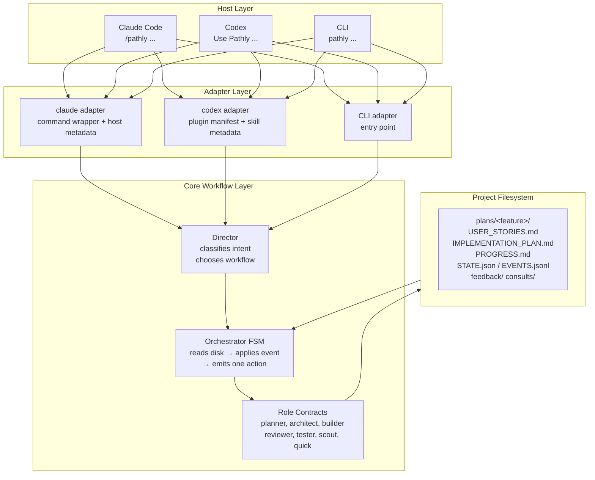

# Installer Design

Consolidated from `INSTALLABLE_WORKFLOW_ARCHITECTURE_PROPOSAL.md` and
`INSTALLABLE_WORKFLOW_ARCHITECTURE_RECOMMENDATIONS.md`.

## Goal

```text
pip install pathly
pathly setup
```

After setup, the user works from the AI coding tool they already use:

```text
Claude Code: /pathly add password reset
Codex:      Use Pathly to add password reset
CLI:        pathly go "add password reset"
```

Pathly remains the workflow brain. Claude Code, Codex, Copilot, and the CLI are host surfaces.

---

## Architecture



**Design boundaries to preserve:**
- Director is the front door and does not implement source changes.
- Orchestrator owns all lifecycle state transitions.
- Filesystem state is the source of truth.
- Adapters expose host-native commands and metadata only.
- Core prompts, role contracts, templates, and runtime behavior stay in Pathly.
- `po` remains optional and on-demand.
- `architect` remains on-demand unless real design uncertainty exists.
- `meet` remains read-only and excludes `director` as a default target.
- Hooks are guardrails, not the main workflow.

---

## Implementation Phases

The key principle: **prove installability before automating setup.**

| Phase | Purpose | Why it comes here |
|---|---|---|
| 0 | Package resource contract | Removes repo-relative assumptions before setup depends on assets |
| 1 | Clean install smoke | Proves `pip install pathly` works outside the source checkout |
| 2 | Setup diagnostics and dry run | Lets users see planned writes before mutation |
| 3 | Adapter materialization | Installs or repairs host adapters from packaged resources |
| 4 | Status and doctor UX | Makes interrupted workflow state understandable |
| 5 | Hook hardening | Adds optional automation after the base workflow is dependable |
| 6 | Host smoke and docs alignment | Verifies Claude Code, Codex, and CLI behavior match docs |

### Phase 0 — Package Resource Contract

Give Pathly one host-neutral way to load packaged assets.

- Add an internal resource API (`pathly.resources`).
- Load prompts, templates, adapter manifests, and skill files through that API.
- Replace direct repo-root path assumptions in CLI and installer code.
- Add tests that exercise resource loading from an installed wheel.

**Verification:**
```bash
python -m build
python -m venv .tmp/pathly-install-smoke
.tmp/pathly-install-smoke/Scripts/pip install dist/pathly-*.whl
.tmp/pathly-install-smoke/Scripts/pathly --version
.tmp/pathly-install-smoke/Scripts/pathly doctor
```

### Phase 1 — Clean Install Smoke

Prove Pathly works without the source checkout.

- Build the wheel; install into a fresh venv.
- Run `pathly --version`, `pathly --help`, `pathly doctor`, `pathly help` from a temp non-Pathly project directory.
- Confirm no command depends on `C:\Users\Yafit\pathly` or another checkout path.

**Acceptance criteria:**
- CLI entry point works from a clean virtual environment.
- Package assets are readable from installed package resources.
- Diagnostics clearly distinguish missing host tools from Pathly install failures.

### Phase 2 — Setup Diagnostics and Dry Run

Make setup transparent before it writes files.

```text
pathly setup           # report only (no mutation)
pathly setup --dry-run # same
pathly setup --apply   # mutate
pathly setup claude --dry-run
pathly setup codex --dry-run
```

Dry-run output must show: detected hosts, Pathly version, planned adapter writes, planned hook registration, existing files that would be replaced, final start command per host.

**Acceptance criteria:**
- No files are written during dry run.
- Output ends with host-specific start commands.
- Unsupported or missing hosts produce useful next steps.

### Phase 3 — Adapter Materialization

Install or repair host adapter files from packaged resources.

- Define explicit user-level Pathly data locations:

| Platform | User-level Pathly data |
|---|---|
| Windows | `%LOCALAPPDATA%\Pathly\` or `%APPDATA%\Pathly\` |
| macOS/Linux | XDG-compatible data directory |
| Project state | Always under the active project `plans/` directory |

- Add `--force` for replacement and `--repair` for stale Pathly-owned files.
- Keep Codex wording as natural language (not slash commands).
- Keep Claude Code slash-command docs separate from Codex plugin docs.

### Phase 4 — Status and Doctor UX

Let users recover after interruption without reading raw FSM internals.

- Add or refine `pathly status [feature]`.
- Summarize: current state, active feedback, next owner, suggested command.
- Keep raw event names hidden unless `--verbose` is passed.
- Make `doctor` distinguish install problems, adapter problems, and workflow state problems.

**Acceptance criteria:**
- Missing state is reported clearly.
- Feedback-blocked state names the blocking feedback file.
- Done state is obvious.
- The next suggested action is a real command for the active host or CLI.

### Phase 5 — Hook Hardening

Keep hooks useful without making them the workflow driver.

**Allowed:**
- Validate paths.
- Add TTL metadata to known feedback files.
- Classify `IMPL_QUESTIONS.md` into `[REQ]` / `[ARCH]` tags.
- Emit diagnostics for stale state or malformed payloads.
- Run fast FSM consistency checks.

**Avoid:**
- Long-running workflows.
- Lifecycle agent spawning.
- Source edits.
- Hidden state advancement.
- Unsupported host schemas presented as working.

Hook failures must be visible and recoverable. They must not corrupt workflow state.

### Phase 6 — Host Smoke and Docs Alignment

| Surface | Smoke check |
|---|---|
| CLI | `pathly go "add password reset"` routes through Director |
| Claude Code | `/pathly help` and `/pathly add password reset` reach the adapter |
| Codex | `Use Pathly help` and `Use Pathly to add password reset` select the plugin skill |
| Hooks | Optional hook install reports exact registered commands and diagnostics |

Docs should only claim behavior that this matrix verifies.

---

## Subagent Policy

The orchestrator owns lifecycle delegation.

```text
Allowed:
  orchestrator → planner, architect, builder, reviewer, tester, quick (retro)
  builder      → scout (read-only lookup), quick (≤2 tool calls), meet (read-only consult)

Avoid:
  builder → reviewer → architect → builder
```

That chain creates uncontrolled agent-to-agent conversation and bypasses FSM state. If a role needs another lifecycle role, it writes a feedback file or consult note — the orchestrator routes the next action.

---

## User Stories

| Story | Accepted when |
|---|---|
| One-command install | `pip install pathly` + `pathly doctor` works outside source checkout |
| Guided setup | `pathly setup` detects hosts and ends with host-specific start commands |
| Host chat surface | Claude Code, Codex, and CLI docs show correct invocations |
| Deterministic FSM | Orchestrator applies one event per step; state recovers from disk after restart |
| Safe hooks | Hooks classify and validate only; never run a full pipeline |
| Bounded subagents | Lifecycle agents spawn only through orchestrator |

---

## Main Risks

| Risk | Mitigation |
|---|---|
| Setup becomes too broad too early | Build resource loading and clean install smoke first (Phase 0→1) |
| Installed package still depends on repo paths | Add package-resource tests and temporary-project smoke tests |
| Host adapter behavior drifts from docs | Add host-specific smoke checklist; keep public docs conservative |
| Hooks accidentally become workflow automation | Keep hook responsibilities deterministic and bounded |
| Existing user installs get overwritten | Add dry run, repair, force, and Pathly-owned file detection |
