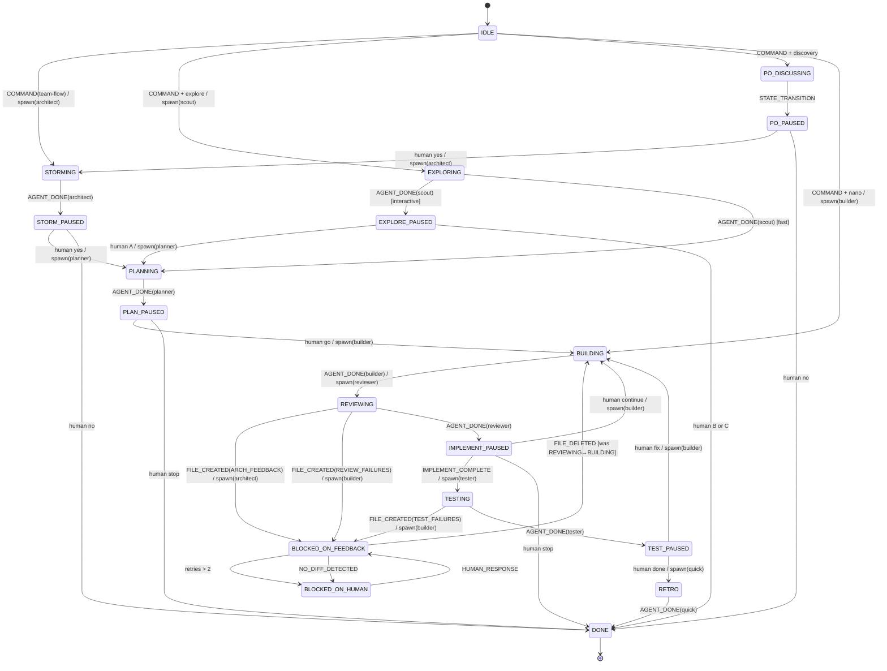

# Orchestrator FSM

The orchestrator is a finite state machine over the filesystem.

It does not depend on hidden conversation memory or agent intuition. Every step is:

1. Read disk.
2. Derive the current state.
3. Apply one event.
4. Write state and event logs.
5. Emit exactly one next action.

## Files

Each feature stores workflow state beside the plan:

```text
plans/<feature>/
|-- STATE.json
|-- EVENTS.jsonl
|-- PROGRESS.md
`-- feedback/
    |-- ARCH_FEEDBACK.md
    |-- REVIEW_FAILURES.md
    |-- IMPL_QUESTIONS.md
    |-- DESIGN_QUESTIONS.md
    |-- TEST_FAILURES.md
    `-- HUMAN_QUESTIONS.md
```

`STATE.json` is a cache and checkpoint. Disk recovery wins if `STATE.json` disagrees with feedback files or `PROGRESS.md`.

`EVENTS.jsonl` is append-only. Each line records an event, previous state, next state, selected action, and timestamp.

## States

```ts
type State =
  | "IDLE"
  | "PO_DISCUSSING"      // option [5] phase 1 — orchestrator asks PO questions, no agent spawn
  | "PO_PAUSED"          // PO Q&A done, waiting for human to proceed to architect storm
  | "EXPLORING"          // option [4] — scout maps codebase
  | "EXPLORE_PAUSED"     // scout done, waiting for A (plan) / B (nano) / C (stop)
  | "STORMING"
  | "STORM_PAUSED"
  | "PLANNING"
  | "PLAN_PAUSED"
  | "BUILDING"
  | "REVIEWING"
  | "IMPLEMENT_PAUSED"
  | "TESTING"
  | "TEST_PAUSED"
  | "RETRO"
  | "BLOCKED_ON_FEEDBACK"
  | "BLOCKED_ON_HUMAN"
  | "DONE"
```

## Events

```ts
type Event =
  | { type: "COMMAND"; value: string }
  | { type: "AGENT_DONE"; agent: AgentName }
  | { type: "FILE_CREATED"; file: FeedbackFile }
  | { type: "FILE_DELETED"; file: FeedbackFile }
  | { type: "HUMAN_RESPONSE"; value: string }
  | { type: "NO_DIFF_DETECTED" }
  | { type: "IMPLEMENT_COMPLETE" }
  | { type: "STATE_TRANSITION"; from_state: State; to_state: State }
  | { type: "SYSTEM_EVENT"; action: "RETRY" | "ERROR" | "TIMEOUT"; metadata: { retry_key?: string } }
```

Only known feedback files under `plans/<feature>/feedback/` count as feedback events.

## Context

```ts
interface Context {
  feature: string
  mode: "interactive" | "fast"
  rigor: "lite" | "standard" | "strict"
  currentConversation?: number
  retryCountByKey: Record<string, number>
  stateStack: State[]          // pushed on FILE_CREATED, popped on FILE_DELETED — supports nested blocks
  activeFeedbackFile?: FeedbackFile
  activeTarget?: AgentName | "human"
  lastActor?: AgentName
}
```

`mode` controls human pauses. `rigor` controls how much workflow structure is required.

Retry keys should include the current conversation and feedback file, for example `conv-2:REVIEW_FAILURES.md`. This prevents unrelated feedback loops from consuming each other's retry budget.

## Rigor Modes

`lite` is the default in the current Pathly workflow. The rigor escalator can
add targeted files when planning discovers risk.

| Rigor | Use for | Required plan files | Gates |
|---|---|---|---|
| `nano` | single-file or trivial fixes (≤2 files changed) | none — direct build, no plan | build only; no review, no retro |
| `lite` | small, low-risk changes | `USER_STORIES.md`, `IMPLEMENTATION_PLAN.md`, `PROGRESS.md`, `CONVERSATION_PROMPTS.md` | plan → build → optional review/test |
| `standard` | normal product features | all 8 plan files | build + review per conversation, test, retro |
| `strict` | auth, payments, data loss, migrations, regulated work | all 8 plan files plus mandatory `STATE.json` and `EVENTS.jsonl` | all standard gates plus mandatory human approvals and audit logs |

`nano` skips all planning files and goes directly to build. It is only valid when the change scope is two files or fewer and no acceptance-criteria verification is required. The orchestrator transitions directly `IDLE → BUILDING`.

`lite` reduces plan surface area but keeps the files needed by the build
workflow.

`standard` is the current pipeline: storm can be skipped, human pauses are default, feedback routing is enforced, and `STATE.json` / `EVENTS.jsonl` are written when runtime support exists.

`strict` is audit-grade workflow. It requires discovery or PRD import before planning, requires human approval at storm, plan, implementation, and test gates, requires review after every conversation, requires complete acceptance-criteria test mapping, and treats missing `STATE.json` or `EVENTS.jsonl` as a workflow error. `strict` should reject `fast` unless a future project explicitly opts into strict automation.

## Rigor Escalator

The rigor escalator promotes a feature from `lite` to `standard` mid-workflow when planning discovers risk factors. The orchestrator reads escalation signals written by the planner or architect and adds the missing plan files before the next build starts.

**Escalation triggers:**

| Signal | Added files | Reason |
|---|---|---|
| Planner writes `[ESCALATE: standard]` in `IMPLEMENTATION_PLAN.md` | `HAPPY_FLOW.md`, `EDGE_CASES.md`, `ARCHITECTURE_PROPOSAL.md`, `FLOW_DIAGRAM.md` | Scope is larger than originally estimated |
| Architect writes `[ESCALATE: strict]` in `ARCHITECTURE_PROPOSAL.md` | `STATE.json`, `EVENTS.jsonl` audit gates | Change touches auth, data migration, or regulated surfaces |
| Builder opens `DESIGN_QUESTIONS.md` twice in one conversation | `ARCHITECTURE_PROPOSAL.md` | Repeated architectural ambiguity signals under-specified design |
| `ARCH_FEEDBACK.md` is created after build starts | `ARCHITECTURE_PROPOSAL.md` | Structural rework required; plan surface insufficient |

**Rules:**
- Escalation is one-way — rigor never decreases mid-workflow.
- Escalation writes the missing files before the next agent spawn; it does not restart the workflow.
- If escalation occurs at `BUILDING`, the orchestrator pauses at `IMPLEMENT_PAUSED` and notifies the user before continuing.

## Feedback Priority

When multiple feedback files exist, route exactly one target at a time:

1. `HUMAN_QUESTIONS.md` -> human
2. `ARCH_FEEDBACK.md` -> architect
3. `DESIGN_QUESTIONS.md` -> architect
4. `IMPL_QUESTIONS.md` -> planner
5. `REVIEW_FAILURES.md` -> builder
6. `TEST_FAILURES.md` -> builder

`ARCH_FEEDBACK.md` blocks all builder work until resolved. `DESIGN_QUESTIONS.md` also routes to architect before planner clarification, because implementation cannot continue while the design is impossible.

## Global Guards

These guards run before normal transitions:

```ts
if (feedback.HUMAN_QUESTIONS) {
  return BLOCKED_ON_HUMAN
}

if (feedback.anyOpen) {
  return BLOCKED_ON_FEEDBACK
}

if (progress.allConversationsDone && state === "IMPLEMENT_PAUSED") {
  emit({ type: "IMPLEMENT_COMPLETE" })
}
```

No forward progress is allowed while any known feedback file exists.

Only one agent may be active at a time.

## Core Transitions

```text
IDLE + COMMAND("team-flow <feature>")
-> STORMING                          // default; orchestrator overrides via STATE_TRANSITION
-> spawn(architect)

// Option [4] — Explore first
IDLE + COMMAND + STATE_TRANSITION(to=EXPLORING)
-> EXPLORING
-> spawn(scout)

EXPLORING + AGENT_DONE(scout)
-> EXPLORE_PAUSED                    // interactive; PLANNING in fast mode

EXPLORE_PAUSED + HUMAN_RESPONSE("A")
-> PLANNING
-> spawn(planner)

EXPLORE_PAUSED + HUMAN_RESPONSE("B"|"C")
-> use STATE_TRANSITION (orchestrator handles nano or stop)

// Option [5] — Full discovery (PO → Architect → Planner)
IDLE + COMMAND + STATE_TRANSITION(to=PO_DISCUSSING)
-> PO_DISCUSSING                     // orchestrator asks PO questions inline, no agent spawn

PO_DISCUSSING + STATE_TRANSITION(to=PO_PAUSED)
-> PO_PAUSED                         // PO_NOTES.md written

PO_PAUSED + HUMAN_RESPONSE("yes")
-> STORMING
-> spawn(architect)

PO_PAUSED + HUMAN_RESPONSE("no")
-> DONE

STORMING + AGENT_DONE(architect)
-> STORM_PAUSED

STORM_PAUSED + HUMAN_RESPONSE("yes")
-> PLANNING
-> spawn(planner)

STORM_PAUSED + HUMAN_RESPONSE("no")
-> DONE

PLANNING + AGENT_DONE(planner)
-> PLAN_PAUSED

PLAN_PAUSED + HUMAN_RESPONSE("go")
-> BUILDING
-> spawn(builder)

PLAN_PAUSED + HUMAN_RESPONSE("stop")
-> DONE

BUILDING + AGENT_DONE(builder)
-> REVIEWING
-> spawn(reviewer)

REVIEWING + FILE_CREATED(ARCH_FEEDBACK.md)
-> BLOCKED_ON_FEEDBACK
-> spawn(architect)

REVIEWING + FILE_CREATED(REVIEW_FAILURES.md)
-> BLOCKED_ON_FEEDBACK
-> spawn(builder)

REVIEWING + AGENT_DONE(reviewer)
-> IMPLEMENT_PAUSED

IMPLEMENT_PAUSED + HUMAN_RESPONSE("continue")
-> BUILDING
-> spawn(builder)

IMPLEMENT_PAUSED + IMPLEMENT_COMPLETE
-> TESTING
-> spawn(tester)

IMPLEMENT_PAUSED + HUMAN_RESPONSE("stop")
-> DONE

TESTING + FILE_CREATED(TEST_FAILURES.md)
-> BLOCKED_ON_FEEDBACK
-> spawn(builder)

TESTING + AGENT_DONE(tester)
-> TEST_PAUSED

TEST_PAUSED + HUMAN_RESPONSE("fix")
-> BUILDING
-> spawn(builder)

TEST_PAUSED + HUMAN_RESPONSE("done")
-> RETRO
-> spawn(quick)

RETRO + AGENT_DONE(quick)
-> DONE
```

Fast mode applies the same transitions, but auto-emits the affirmative human responses at pause states. `strict` mode does not auto-emit human approvals.

## Feedback Loop

Entering `BLOCKED_ON_FEEDBACK` selects the highest-priority open feedback file and increments its retry key, except for `HUMAN_QUESTIONS.md` and zero-diff escalation.

```text
BLOCKED_ON_FEEDBACK + FILE_DELETED(activeFeedbackFile)
-> stateStack.pop()   (restores the state that was active before FILE_CREATED)
```

If a retry key exceeds 2:

```text
BLOCKED_ON_FEEDBACK
-> BLOCKED_ON_HUMAN
-> write HUMAN_QUESTIONS.md
```

If builder finishes a `REVIEW_FAILURES.md` resolution and no implementation diff exists:

```text
BLOCKED_ON_FEEDBACK + AGENT_DONE(builder) + NO_DIFF_DETECTED
-> BLOCKED_ON_HUMAN
-> write HUMAN_QUESTIONS.md
```

## Recovery

Recovery reconstructs state by reading:

- `plans/<feature>/feedback/*.md`
- `plans/<feature>/PROGRESS.md`
- `plans/<feature>/STATE.json`
- `plans/<feature>/EVENTS.jsonl`

Recovery order:

1. If `HUMAN_QUESTIONS.md` exists, state is `BLOCKED_ON_HUMAN`.
2. If any feedback file exists, state is `BLOCKED_ON_FEEDBACK`.
3. If all conversations are done and tests have not passed, state is `TESTING` or `TEST_PAUSED` based on the latest event.
4. If any conversation is TODO, state is `BUILDING` or `IMPLEMENT_PAUSED` based on the latest event.
5. If plan files exist but no build started, state is `PLAN_PAUSED`.
6. If `STORM_SEED.md` exists but no plan files, state is `STORM_PAUSED`.
7. If `PO_NOTES.md` exists but no `STORM_SEED.md`, state is `PO_PAUSED`.
8. Otherwise state is `IDLE`.

## Observability

Every transition should produce logs like:

```text
[EVENT] AGENT_DONE(builder)
[STATE] BUILDING -> REVIEWING
[ACTION] spawn(reviewer)
[FILE] REVIEW_FAILURES.md created
[STATE] REVIEWING -> BLOCKED_ON_FEEDBACK
[STACK] ["REVIEWING"]
[ACTION] spawn(builder)
```

Each `EVENTS.jsonl` line must include a `stack` field reflecting the `stateStack` after the transition. This makes the nested-blocking state visible and recoverable without re-reading feedback files:

```jsonl
{"ts":"2026-05-11T10:00:00Z","event":"FILE_CREATED","file":"REVIEW_FAILURES.md","prev":"REVIEWING","next":"BLOCKED_ON_FEEDBACK","action":"spawn(builder)","stack":["REVIEWING"],"retry_key":"conv-2:REVIEW_FAILURES.md","retries":1}
{"ts":"2026-05-11T10:05:00Z","event":"FILE_DELETED","file":"REVIEW_FAILURES.md","prev":"BLOCKED_ON_FEEDBACK","next":"REVIEWING","action":"spawn(reviewer)","stack":[],"retry_key":"conv-2:REVIEW_FAILURES.md","retries":1}
```

A corrupt or missing `stack` field during recovery means the orchestrator cannot know which state to pop back to. In that case, fall back to the full disk-recovery algorithm (see Recovery section) rather than using `STATE.json` alone.

The event log is the audit trail. The state file is the checkpoint. The filesystem is the source of truth.

## State Diagram


